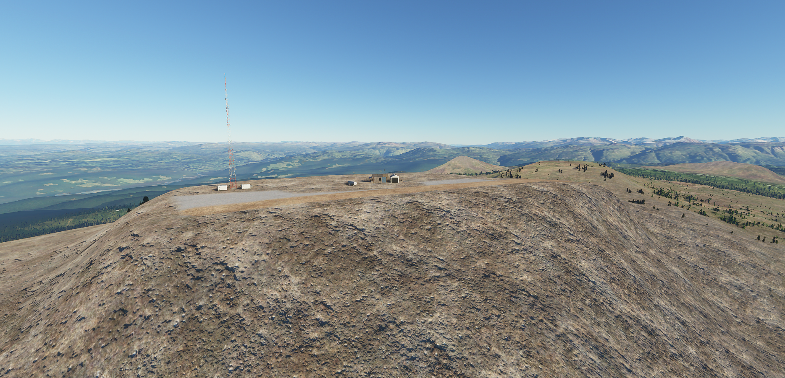
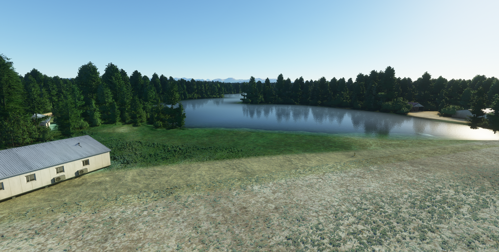
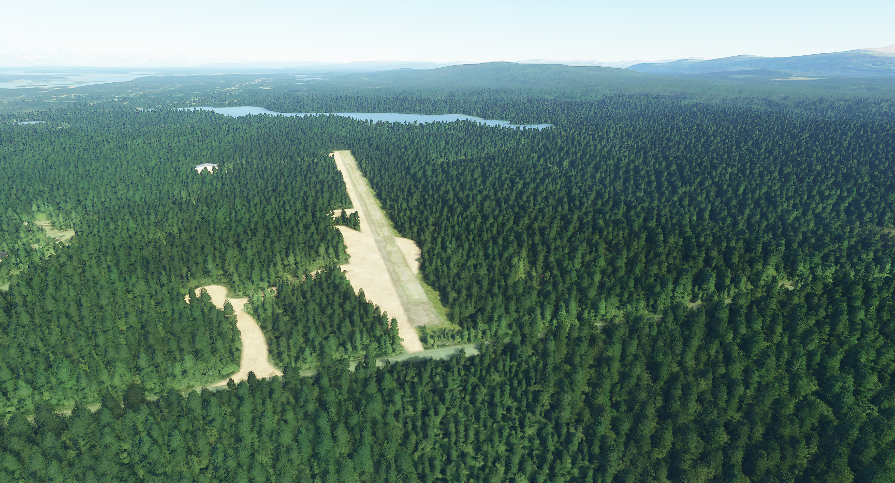

# Talkeetna Area Airport and Scenery Pack

## PATK - Talkeetna Airport   2AK7 - Bald Mountain Airstrip   AK19 - Carl's Landing Airport   51AK - Birch Creek Landing Airport   AK44 - Talkeetna Village Airstrip   0AA5 - Rangeview Airstrip

#### Author: Julysfire
Discord: julysfire#9465        MSFS2020: blackflame0729

##### Description
5 handcrafted airports in 1 package!

- PATK: Talkeetna Airport in Talkeetna, Alaska, USA
- 2AK7: Bald Mountain Airstrip in Talkeetna, Alaska, USA
- AK19: Carl's Landing Airport in Talkeetna, Alaska, USA
- 51AK: Birch Creek Landing Airport in Talkeetna, Alaska, USA
- AK44: Talkeetna Village Airstrip in Talkeetna, Alaska, USA
- 0AA5: Rangeview Airstrip in Trapper Creek, Alaska, USA

PATK Cords: [62°19'15.4"N 150°05'36.4"W](https://www.google.com/maps/place/62%C2%B019'15.4%22N+150%C2%B005'36.4%22W/@62.3209469,-150.0956331,521m/data=!3m2!1e3!4b1!4m5!3m4!1s0x0:0x0!8m2!3d62.3209444!4d-150.0934444)   2AK7 Cords: [62°18'27.1"N 149°45'07.5"W](https://www.google.com/maps/place/62%C2%B018'27.1%22N+149%C2%B045'07.5%22W/@62.3075303,-149.754272,522m/data=!3m2!1e3!4b1!4m5!3m4!1s0x0:0x0!8m2!3d62.3075278!4d-149.7520833)   AK19 Cords: [62°10'26.4"N 150°03'50.6"W](https://www.google.com/maps/place/62%C2%B010'26.4%22N+150%C2%B003'50.6%22W/@62.1740025,-150.0662443,524m/data=!3m2!1e3!4b1!4m5!3m4!1s0x0:0x0!8m2!3d62.174!4d-150.0640556)   51AK Cords: [62°14'17.9"N 150°03'49.8"W](https://www.google.com/maps/place/62%C2%B014'17.9%22N+150%C2%B003'49.8%22W/@62.2383081,-150.066022,523m/data=!3m2!1e3!4b1!4m5!3m4!1s0x0:0x0!8m2!3d62.2383056!4d-150.0638333)   0AA5 Cords: [62°18'46.0"N 150°20'09.0"W](https://www.google.com/maps/place/62%C2%B018'46.0%22N+150%C2%B020'09.0%22W/@62.3127803,-150.338022,522m/data=!3m2!1e3!4b1!4m5!3m4!1s0x0:0x0!8m2!3d62.3127778!4d-150.3358333)  

##### Summary

This is a pack of airports in the Talkeetna, Alaska area.  Some of the airports were missing and have now been added, some airports were not in good condition from the auto generated area and height maps.  The surrounding water ways also suffered from this issue and were often very hilly and bumpy which made the shores look horrible as well.  This pack will address these issues while including one of the most intersting airports/airstrips I have encountered yet, 2AK7 - Bald Mountain Airstrip.  This is a small airstrip that is on top of a mountain with the runways ending in cliffs.  Have fun landing and taking off out of this airport!  This pack is perfect for some beautiful Alasakan VFR scenery.  I have worked on all these airports by hand in an effort to make realistic representations of each airports included.  All I ask is that you have fun and enjoy!

PATK Airnav: <https://www.airnav.com/airport/PATK>   2AK7 Airnav: <https://www.airnav.com/airport/2AK7>   AK19 Airnav: <http://www.airnav.com/airport/AK19>   51AK Airnav: <https://www.airnav.com/airport/51AK>   AK44 Airnav: <https://www.airnav.com/airport/AK44>   OAA5 Airnav: <http://www.airnav.com/airport/0AA5>

##### Features

- **2AK7 is an entire airstrip that is not currently in the base game**
    - This is a small little brush strip on top of a mountain!  Try out your brush landing skills and land on top for some beautiful Alaskan views!

- **AK44 is an entire airstrip that is not currently in the base game**
    - A small airstrip on the Southern part of Talkeetna with the runway ending at the river.  Beautiful fly ins over the river or the town center of Talkeetna.
	
- Lots of fixes to the other airports including massive height fixes to the runways to make them useable (height/trees/ect)

- Hand crafted airports and scenery of surrounding area
- Handful of GA parking spots at each airport
- Absolutely tons of river, lake, and other height fixes in the area (~150-200 total miles by my last estimate, I lost count to be honest...)
- Better ground textures and vegetation of the surrounding area
- Realistic look and feel during the day and night based on satellite imagery
- Beautiful Alaskan scenery perfect for VFR flights

#### ---Installation Instructions---
1. Download the .zip file from Releases (or zip file here)
2. Extract files to the your Microsoft Flight Simulator Community Folder

For the Microsoft Store edition AND/OR Gamepass edition:

	C:\Users\[YOUR USERNAME]\AppData\Local\Packages\Microsoft.FlightSimulator_<RANDOMLETTERS>\LocalCache\Packages\Community
	
For the Steam edition:

	C:\Users\[YOUR USERNAME]\AppData\Roaming\Microsoft Flight Simulator\Packages\Community
	
For the Boxed edition:

	C:\Users\[YOUR USERNAME]\AppData\Local\MSFSPackages\Community

## Screenshots
See the Screenshots\Before\ folder for before shots of very hilly water, raised lakes, bad runway elevation, ect

### Bald Mountain Airport

### Talkeetna Airport

### Talkeetna Village Airstrip

### Carl's Landing Airport

## Birch Creek Landing Airport

### Rangeview Airstrip

### Other

##### Note

- I noticed the first time I loaded the package, the water height was still messed up from a distance but upon getting closer to it, it fixed itself.  After reloading into the Sim, it doesn't do that.  If you see bad water height upon first loading in, try flying near it or reloading.

#### TODO

- Snow sticks to the TALKEETNA lettering, need to change that.

If you enjoyed it as well and would like to donate, it is very much appreciated but never will be required.  I am doing this to add to the community's total assets of airports and scenery and because honestly, I found I really enjoy doing this.  I only strive to make content that others can enjoy.
http://paypal.me/julysfire or https://www.buymeacoffee.com/julysfire
